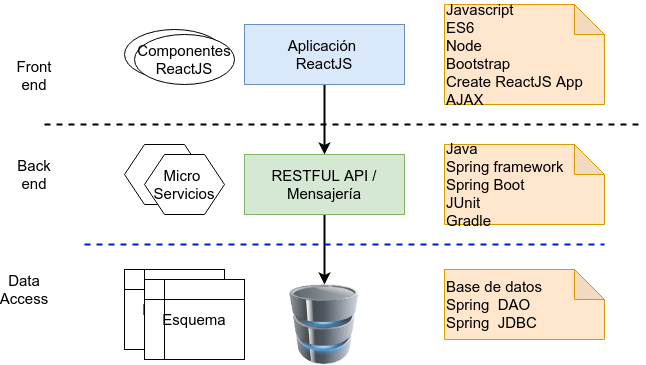

# SchoolBook
## Introducción
* Caso de estudio referente a una empresa que administra bibliotecas y venta de libros.
* El propósito de este proyecto es 100% académico, dirigido especialmente a estudiantes de los últimos semestres de carreras asociadas con el desarrollo de software. 
* A nivel general se implementan los conceptos básicos para realizar desarrollos multicapa así como la incorporación de conceptos básicos de la arquitectura de *micro servicios* y tecnologías asociadas. 
* Cualquier interesado en contribuir es bienvenido!
##  Arquitectura básica.
* De forma muy sencilla la arquitectura propuesta para esta aplicación se describe en la siguiente imagen. 

## Preparar ambiente de desarrollo.
### Instalación de herramientas
* Instalación JDK de Java ([Open JDK](https://openjdk.java.net/)) 
* Instalación de la IDE de desarrollo [Spring Tool Suite](https://spring.io/tools)
* Uso del algún editor de texto, de preferencia [Visual Studio Code](https://code.visualstudio.com/).
## Documentación y diseño
* Revisar la carpeta docs en la que se encuentran los siguientes documentos:
	* Definición del caso de estudio
	* Definición básica de servicios
	* Diseño de bases de datos y esquemas (modelos relacionales).
## Código fuente
* El código fuente del proyecto se distribuye en diversos repositorios.
	* [schoolbook](https://github.com/jorgerdc/schoolbook) (este repositorio)  Contiene la definición del proyecto, documentación, así como el código de la aplicación web.
	* schoolbook-usuarios
	* schoolbook-libros
	* schoolbook-prestamos
	* schoolbook-bibliotecas
	* schoolbook-ordenes
